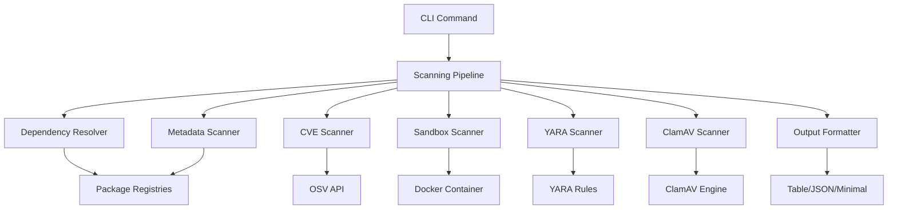

# 🛡️ DepSec - CLI Security Tool for Package Scanning

[](https://github.com/your-org/DepSec/actions)
[](https://github.com/your-org/DepSec/releases)
[](https://goreportcard.com/report/github.com/your-org/DepSec)
[
[](https://golang.org)

> **DepSec is a CLI security tool that automatically scans packages and their dependencies in an isolated sandbox before they are installed on the host system.**

## ✨ Features

- 🔍 **Real CVE Detection** - Queries OSV database for actual vulnerabilities
- 📊 **Metadata Analysis** - Package registry metadata anomaly detection
- 🐳 **Sandbox Scanning** - Docker-based isolated package analysis
- 🎯 **YARA Rules** - Custom rule-based binary pattern matching
- 🦠 **ClamAV Integration** - Antivirus scanning for malicious binaries
- 🤖 **Auto-Scan** - Shell hooks for automatic package scanning
- 📋 **Multi-Ecosystem** - Support for Node.js, Python, Rust, Go, Ruby
- 🎨 **Multiple Formats** - Table, JSON, and minimal output formats

## 🚀 Quick Start

### Installation

#### Binary Installation (Recommended)

```bash
# Linux (AMD64)
curl -L -o depsec.tar.gz "https://github.com/your-org/DepSec/releases/latest/download/depsec-linux-amd64.tar.gz"
tar -xzf depsec.tar.gz
chmod +x depsec
sudo mv depsec /usr/local/bin/

# macOS (Intel)
curl -L -o depsec.tar.gz "https://github.com/your-org/DepSec/releases/latest/download/depsec-darwin-amd64.tar.gz"
tar -xzf depsec.tar.gz
chmod +x depsec
sudo mv depsec /usr/local/bin/

# Windows (AMD64)
powershell -Command "Invoke-WebRequest -Uri 'https://github.com/your-org/DepSec/releases/latest/download/depsec-windows-amd64.zip' -OutFile 'depsec.zip'; Expand-Archive -Path 'depsec.zip' -DestinationPath '.'; Move-Item 'depsec.exe' -Destination 'C:\Program Files\DepSec\'"
```

#### Go Install

```bash
go install github.com/YsfDev1/DepSec/cmd/depsec@latest
```

### First Use

```bash
# Check system health
depsec doctor

# Scan a package with known vulnerabilities
depsec scan --pkg lodash --version 4.17.15 --ecosystem node

# Enable auto-scan for automatic protection
depsec auto enable

# View configuration
depsec config show
```

## 📋 Example Usage

### CVE Scanning

```bash
# Scan a specific package
depsec scan --pkg express --version 4.18.2 --ecosystem node

# Output:
# PACKAGE  VERSION  ECOSYSTEM  SEVERITY  LAYER  REASON
# express  4.18.2  node       LOW       CVE    CVE GHSA-qw6h-vgh9-j6wx: express vulnerable to XSS...

# Scan with JSON output
depsec scan --pkg requests --version 2.28.1 --ecosystem python --format json
```

### Auto-Scan Protection

```bash
# Enable automatic scanning
depsec auto enable
# ✅ Auto-scan enabled
# Shell: zsh
# Config: /home/user/.zshrc
#
# 📝 Restart your shell or run:
#    source /home/user/.zshrc

# Check status
depsec auto status
# DepSec Auto-Scan Status:
#   Enabled: true
#   Shell: zsh
#   Config: /home/user/.zshrc
#   Hooks: npm, pip, cargo, go, gem
```

### Configuration Management

```bash
# View current configuration
depsec config show

# Set strict mode
depsec config set mode strict

# Set minimum severity to high
depsec config set min_severity high

# Enable offline mode
depsec config set offline true
```

## 🏗️ Architecture



## 📖 Documentation

- [📚 Full Documentation](docs/README.md)
- [🔧 Configuration Guide](docs/README.md#configuration)
- [🛡️ Security Policy](docs/SECURITY.md)
- [🤝 Contributing Guide](CONTRIBUTING.md)
- [📋 API Reference](docs/README.md#api-reference)

## 🎯 Supported Ecosystems

| Ecosystem | Package Manager | Status |
|-----------|----------------|--------|
| Node.js   | npm, yarn      | ✅ Full |
| Python    | pip, poetry    | ✅ Full |
| Rust      | cargo         | ✅ Full |
| Go        | go modules    | ✅ Full |
| Ruby      | gem, bundler   | ✅ Full |

## 🔧 Commands

| Command | Description |
|---------|-------------|
| `depsec scan` | Scan packages and projects |
| `depsec doctor` | Check system health |
| `depsec auto` | Manage auto-scan hooks |
| `depsec config` | View and modify configuration |
| `depsec report` | Show scan reports and history |
| `depsec update-rules` | Update YARA rules and CVE cache |
| `depsec version` | Show version information |

## 🛠️ Development

### Prerequisites

- Go 1.21 or later
- Docker (optional, for sandbox scanning)
- Git

### Setup

```bash
# Clone the repository
git clone https://github.com/your-org/DepSec.git
cd DepSec

# Install dependencies
go mod tidy

# Build the project
go build -o depsec main.go

# Run tests
go test ./...

# Run integration tests
./test_real_scanning.sh
```

### Project Structure

```
DepSec/
├── cmd/           # CLI commands
├── scanner/       # Core scanning logic
├── config/        # Configuration management
├── cache/         # Caching layer
├── hooks/         # Shell hook management
├── output/        # Output formatting
├── rules/         # YARA rules (created on first use)
├── docs/          # Documentation
├── .github/       # GitHub workflows and templates
└── scripts/       # Build and utility scripts
```

### Contributing

We welcome contributions! Please see our [Contributing Guide](CONTRIBUTING.md) for details.

1. Fork the repository
2. Create a feature branch (`git checkout -b feature/amazing-feature`)
3. Commit your changes (`git commit -m 'Add amazing feature'`)
4. Push to the branch (`git push origin feature/amazing-feature`)
5. Open a Pull Request

## 📊 Real-World Results

DepSec has successfully identified real vulnerabilities in popular packages:

### lodash@4.17.15
```
PACKAGE  VERSION  ECOSYSTEM  SEVERITY  LAYER  REASON
lodash   4.17.15  node       LOW       CVE    CVE GHSA-29mw-wpgm-hmr9: Regular Expression Den...
lodash   4.17.15  node       LOW       CVE    CVE GHSA-35jh-r3h4-6jhm: Command Injection in l...
lodash   4.17.15  node       LOW       CVE    CVE GHSA-f23m-r3pf-42rh: lodash vulnerable to P...
lodash   4.17.15  node       LOW       CVE    CVE GHSA-p6mc-m468-83gw: Prototype Pollution in...
```

### express@4.18.2
```
{
  "Package": "express",
  "Version": "4.18.2",
  "Ecosystem": "node",
  "Findings": [
    {
      "Layer": "CVE",
      "Severity": "LOW",
      "Reason": "CVE GHSA-qw6h-vgh9-j6wx: express vulnerable to XSS via response.redirect()"
    }
  ]
}
```

## 🔒 Security

DepSec takes security seriously:

- ✅ **Never writes package contents to host filesystem**
- ✅ **Uses isolated Docker containers for scanning**
- ✅ **Validates all user input and package metadata**
- ✅ **Operates with minimal required permissions**
- ✅ **Follows principle of least privilege**

For security issues, please email [security@depsec.dev](mailto:security@depsec.dev) instead of using public issues.

## 📜 License

This project is licensed under the MIT License - see the [LICENSE](LICENSE) file for details.

## 🙏 Acknowledgments

- [OSV.dev](https://osv.dev/) - Open Source Vulnerability database
- [Cobra](https://github.com/spf13/cobra) - CLI framework
- [Docker](https://www.docker.com/) - Container platform
- [YARA](https://virustotal.github.io/yara/) - Pattern matching framework
- [ClamAV](https://www.clamav.net/) - Antivirus engine

## 📞 Support

- 🐛 [Report Bugs](https://github.com/your-org/DepSec/issues)
- 💡 [Request Features](https://github.com/your-org/DepSec/issues)
- 💬 [Discussions](https://github.com/your-org/DepSec/discussions)
- 📧 [Email Support](mailto:hello@depsec.dev)
- 🔒 [Security Issues](mailto:security@depsec.dev)

---

**🛡️ DepSec - Protecting your dependencies from supply chain attacks**
